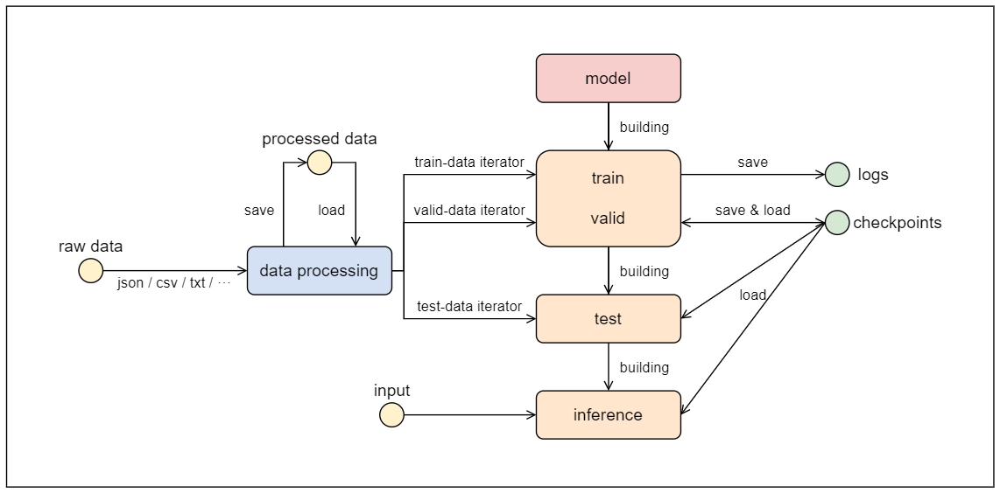
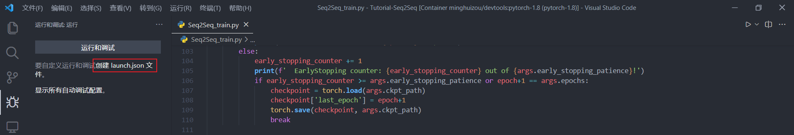
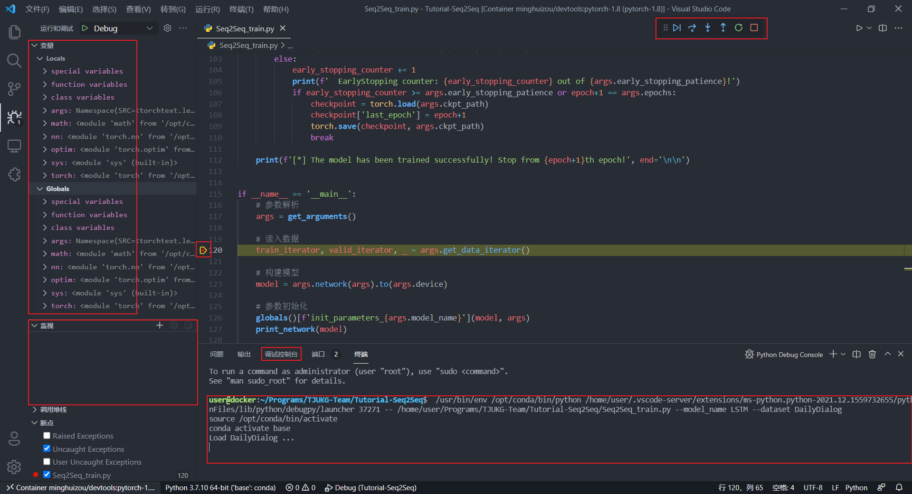

## 项目数据流



## 项目文件结构

```shell
.
├── assets # 与项目源码无紧密关系的资料
│   ├── README/ # README.md中的图片
│   └── pytorch-seq2seq/ # 参考项目
├── datasets # 数据集
│   ├── DailyDialog.py # data processing
│   ├── Multi30k.py # data processing
│   ├── dailydialog/ # raw data
│   └── multi30k/ # raw data
├── models # model
│   ├── GRU.py
│   ├── GRU_Attention.py
│   └── LSTM.py
├── scripts # 脚本（简化命令、运行多组参数）
│   ├── inference.sh
│   ├── tensorboard.sh
│   ├── test.sh
│   └── train.sh
├── utils # 一些辅助函数
│   ├── logger.py # Tensorboard可视化
│   └── network.py # 模型参数相关的函数（参数初始化、统计可训练参数数量等）
├── Seq2Seq_config.py # 模型相关的配置（数据存储路径、超参数等）
├── Seq2Seq_inference.py # inference
├── Seq2Seq_test.py # test
└── Seq2Seq_train.py # train、valid
```

## 补充说明

- 因为本项目没有特别详细的注释，推荐先看看`assets/pytorch-seq2seq`中的notebook（只看第1个就行，流程上是一样的）
- 如果觉得直接顺着代码读有困难的话，可以用debug模式，边运行边看每行命令有哪些影响
- 项目的入口文件包含：`Seq2Seq_train.py`、`Seq2Seq_test.py`、`Seq2Seq_inference.py`
- 快捷运行本项目的脚本文件：`scripts/*.sh`

## VS Code之Debug

### 实验环境

- 使用的docker镜像：`minghuizou/devtools:pytorch-1.8`
- 在VS Code中创建容器并连接，可以参考这个文档：[docker-Tutorial](https://github.com/TJUKG-Team/Tips-Sharing/wiki/docker-Tutorial#docker的简易教程)
- 容器中打开终端，运行：

```shell
pip install -r requirements.txt

# 网络问题的话可以手动下载后放进容器里，然后执行：pip install en_core_web_sm-3.2.0.tar.gz
pip install https://github.com/explosion/spacy-models/releases/download/en_core_web_sm-3.2.0/en_core_web_sm-3.2.0.tar.gz

# 网络问题的话可以手动下载后放进容器里，然后执行：pip install de_core_news_sm-3.2.0.tar.gz
pip install https://github.com/explosion/spacy-models/releases/download/de_core_news_sm-3.2.0/de_core_news_sm-3.2.0.tar.gz
```

- 容器中随便打开一个python文件，按`Shift + Alt + F`格式化文档，提示是否安装格式化程序`autopep8`，选择`是`，用pip安装

### Debug

- 创建launch.json（文件保存在当前路径下的`.vscode/launch.json`）



- 配置launch.json

```shell
{
    "version": "0.2.0",
    "configurations": [
        {
            "name": "Debug",
            "type": "python",
            "request": "launch",
            "program": "${file}",
            "console": "integratedTerminal",
            "cwd": "${fileDirname}", 	// debug时切换工作路径至当前路径
            "args": [ 					// 设置命令行参数
                "--model_name", "LSTM", // 命令行参数之间的空格用,替代
                "--dataset", "DailyDialog"
            ]
        }
    ]
}
```

- 界面介绍
  - 变量：局部变量和全局变量（变量值发生变化会有高亮显示）
  - 监视：对某一变量右键可以选择添加到监视，或者使用+号自定义表达式
  - 调试控制台：可以在此处输入一行代码（懂点编译原理的话，一行命令其实可以是很多行命令，以python为例，python虽然是用缩进来判断语句的分组，但是也支持`;`号，可以用`;`号将多行命令写出一行，不过一般用不太上），进行变量相关的操作（添加、修改、打印之类的）
  - 其他地方就是常规的debug方式：添加断点、F5运行到下一个断点、F10单步运行、F11进入函数内部等



- PyTorch是动态图，计算图与数据不分离，debug模式很好操作，变量值的变化会导致变量名高亮
- TensorFlow是静态图，计算图与数据分离，变量值的变化不一定会导致变量名高亮，因为静态图中的变量值其实是指向计算图节点的指针，和节点对应的数据没有关系，只要指针不变，就算节点对应的数据发生变化，也不会导致变量名高亮
